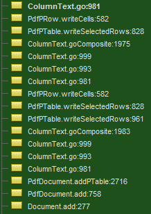
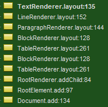

Many of you are aware that iText Software provides [dedicated support](http://itextpdf.com/support) to its paying customers. However, we also have a very large user base which complies with the AGPL license. Since they don't pay for technical support, they have to rely on their own debugging skills and, as a fallback channel, on [StackOverflow](https://stackoverflow.com/questions/tagged/itext) to solve their iText problems.

Those who have stared into the abyss of iText 5's [`ColumnText::go`](https://github.com/itext/itextpdf/blob/develop/itext/src/main/java/com/itextpdf/text/pdf/ColumnText.java#L997) method, and survived, know that debugging our good old rendering engine could be a daunting task because of that method's recursive nature and opaque method overrides. `ColumnText::go` was the organic result of almost 20 years of refactoring of the original iText code, and it's one of the prime examples why we chose to reimplement our library.

The main innovation of the new implementation is the Renderer Framework. Its architecture is explained in detail in the introduction to the [technical tutorial](http://developers.itextpdf.com/content/itext-7-building-blocks/we-start-overview-classes-and-interfaces) for iText 7. The Framework defines three main concepts:

* `Element`s are the high-level layout objects that will be rendered
* `RootElement`s are the background upon which layout objects are drawn. They function as element containers.
* `Renderer`s draw the `Element`onto the `RootElement`
	* `RootElement` objects also have a special `RootRenderer`, which will perform calculations for layout positionings
	
The Renderer objects implement the methods defined in the `IRenderer` interface:
* layout(): will calculate how much of the object will fit onto the RootElement
* getOccupiedArea(): gets the area that the Element will try to occupy
* draw(): will write the graphical instructions to the RootElement
* isFlushed(): determines whether draw() has already been called
* addChild(), setParent(), getChildRenderers(), getNextRenderer(): methods for constructing and querying the hierarchy of the Renderer tree

Every element has its own renderer type, and uses it by default. It is exceedingly easy to customize the rendering rules for a certain object or type, by plugging into the layout object a modified subclass of the `Element`'s default renderer, or an entirely homebrewn `Renderer` implementation.

As already hinted at in the introduction to this post, another great advantage lies in debugging your application. Instead of a turtles-all-the-way-down stack of go() calls, you clearly see where, and how deep, in the hierarchy you are:

