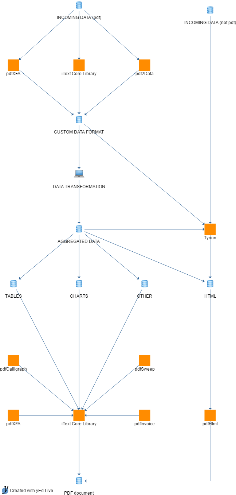

# about us

iText is a software developer toolkit that allows users to integrate PDF functionalities within their applications, processes or products. You know that PDF is one of the world's most widely used document formats, but perhaps you didn't know how it can keep being revolutionary? iText, in turn, is one of the best-documented and versatile PDF engines in the world. By harnessing the power of pdf with the iText libraries and addons, you can really move towards a smart document workflow.

# document workflow

**Figure 1**: A somewhat complete overview of the many ways iText can enrich your document workflow

iText can be used in many places of your document workflow.
From data aquisition (pdf2Data, pdfXFA, iText Core Library), to data transformations (pdfHtml), document generation (pdfHtml, Tyrion, pdfInvoice, iText Core Library) to redaction (pdfSweep).
Our software suite allows you to effortlessly handle digital documents in a way that can be tailored to your workflow.

## information aquisition

For information aquisition, iText can help process incoming pdf document. If your data is structured enough, you could benifit from using pdf2Data wich allows you to use templating to extract data in xml form. If your data is unstructured, you could use the iText Core Library to extract raw text, images, links, etc. If you have a pdf document that contains forms, pdfXFA can help you obtain the information your end-users filled in.

## pdf generation

### program your document

### templating

## pdf redaction

# example usecase(s)

# learn more