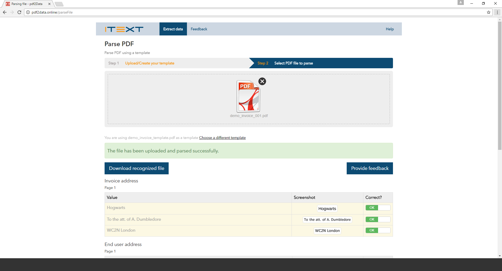

# pdf2Data : Whitepaper

## Brief

### What is it?

pdf2Data is a framework recognizing data inside PDF documents that are based on the same template such as an invoice coming from the same supplier.
This makes it easier to automate your template document workflow and drastically cut your processing time. 
pdf2Data also allows you to cut down on both human error and response time, by automating your processes in a rule based way.

The data recognition is based on a number of rules, which need to be defined in advance per each template field. Typical rules are:
* the same (horizontal / vertical) position on the page
* the same font size and style
* certain text pattern (numeric, currency sign, etc)
* certain keywords on the same as the required field
* certain cell(s) in the table
* ..

From a technical side:

* This means that you can create a fully automated solution for data recognition in PDF document with basic set-up on the original sample template. 
The template relies on dynamic field selectors such as font, styl,e position and text patterns to find the required fields in your data. 
It also leverages iText text extraction, which offers a high fidelity recognition process.
 
* pdf2Data also comes with a convenient web application to enable you to define the selectors in a more intuitive wa than the previous method of relying on a PDF commenting tool such as Adobe Reader to define the selectors in special syntax.

* It is also easilty integrated with pure Java API with CLI (command line interface) and REST interfaces.
 
* It makes use of iText text extraction, which renders high fidelity recognition of your data.

### How does it work?

The whole recognition is based on the following steps:

1. Select parts of the template that correspond to your data fields using the pdf2Data web application or any PDF Viewer with commenting functionality. 
2. Define relevant rules for the correct data extraction in the comment attached to each selection. 
3. Upload the template to our web site and see if we recognized your fields and data inside them. 
4. Upload any other PDF document that is based on the same template and check if we were able to recognize your data.

Steps 1 to 3 need to be done only once per template. Step 4 can be repeated for as many documents as needed. But they all need to be based on the same template. 

## Simple example


**Figure 1**: landing page of pdf2Data web application


**Figure 2**: an example selector to extract the customer address


**Figure 3**: the template, opened in Adobe Acrobat


**Figure 4**: sample extraction

## A more in-depth look

### About the selectors

| name | functionality |
|------|---------------|
| fontFamily |	This selector extracts the font name of the annotated text region and then uses this font name to filter glyphs with that font name. It is assumed that all the annotated text of the region has the same font family.|
| fontSize |	This selector extracts the font size of the annotated text region and then uses this font size to filter glyphs with that font size. It is assumed that all the annotated text of the region has the same font size.|
| fontStyle |	This selector extracts the font style of the annotated text region, e.g. bold, italic, and then uses this font style to filter glyphs with this font style. It is assumed that all the annotated text of the region has the same font style. |
| font	| The font selector identifies the font used for the text in the selector region and extracts all symbols with the same font from the PDF document. If the text in the selector region uses several fonts, only the first one is used. The font is considered as a combination of the font family, font size and font style. If only some of these properties should be honoured when extracting text, please use selectors fontFamily, fontSize, fontStyle |

### Typical usecase : processing an invoice

### Boilerplate code

```java

// build a new Pdf2DataExtractor based on a template
Pdf2DataExtractor extractor = new Pdf2DataExtractor(template);

// sampleFile: the file you wish to process
// targetPdf: the path where you wish to store the annotated pdf (for visual inspection)
// targetXML: the path where you wish to store the extracted data (in xml format)
extractor.parsePdf(sampleFile, targetPDF, targetXML);

```

## Practical guidelines

1. Use the boundary selector with all four borders enabled to check that the text can be extracted.
	
	pdf2Data relies on internal PDF structure rather than visual presentation to extract the text. 
	Not all text visible in the document can be reliably extracted from PDF documents. 
	The boundary selector triggers one of the simplest low level text extraction algorithms, and it is always a good idea to try first or if other selectors don’t work for your document.

2. Do not use the boundary selector with all four sides enabled in the final version of the template, unless the text has a fixed position on the page and can not grow depending on the variable data.

	Try the table selector in the automatic mode if your data is located inside a table cell.
	Table selector in automatic mode is the best choice for tables with clear borders around the cells (or at least between columns). 
	It also tries a number of smart heuristic algorithms even if your table does not have any borders at all. 

3. Use the pattern selector if your data is surrounded by boiler-plate text (i.e. text that is unlikely to change and always precedes or follows after the important data).
	e.g. "total price: xxxx EUR"
	
4. Use the paragraph selector to combine several lines into a single paragraph or to select a paragraph with a predefined first (title) line.
	Sometimes the extracted text comes out as a sequence of distinct lines. You can always try combining them into a single paragraph using Paragraph selector at the end. 
	Paragraph selectors can also be used very efficiently to allocate the blocks of text with a predefined first (title) line.

## Deploying your own pdf2Data web application

1. Download a Java SE Development Kit 8 and install it.
2. Download a Apache Tomcat 8.x software and install it.
3. Download the pdf2Data web application war file
4. Deploy the application on the installed Tomcat server
   In most cases it is sufficient to copy a war file into subdirectory webapps in Tomcat directory
 
5. Create the file “web.properties” as follows
```
dir.temp=your_folder_for_resources
mail.to=pdf2data@duallab.com
mail.smtp.host=smtp.duallab.com
mail.smtp.port=25
mail.ssl.smtp.port=567
mail.ssl.enable=false
mail.smtp.starttls.enable=false
mail.from=your email address
user.name=your email address
user.password=your email password
```

## Using the Command Line Interface (CLI)

Using the CLI is done in a two-step process. First the template pdf is pre-processed. The annotations are extracted, along with their corresponding selectors, and stored in an xml file.
The parser then uses the template information in the xml file alongside the document to be processed to produce both an xml document (containing the data) and a pfd document containing information about the recognition (for quality control purposes.)

### Preprocessor

```
java -jar preprocess.jar --template=Tempate.pdf --xml=Template.xml
Arguments:
-t=Template.pdf, --template=Template.pdf
This argument defines a template PDF file that contains annotations with rules for each region.

-x=Template.xml, --xml=Template.xml
This argument defines an XML file that will contain rules for each region we want to recognize after preprocessing of the corresponding PDF file.
```

### Parser

```
java -jar parse.jar --template=Template.xml --pdf=Test.pdf --outPdf=pdfFile.pdf --outXml=xmlFile.xml
Arguments:
-t=Template.xml, --template=Template.xml
This argument defines an XML file with rules for recognizing regions of data.

-p=Test.pdf, --pdf=Test.pdf
This argument defines a PDF file with data we want to recognize.

-r=pdfFile.pdf, --outPdf=pdfFile.pdf
This argument defines a PDF file that will contain visual representation of recognized elements in the form of annotations.

-x=xmlFile.xml, --outXml=xmlFile.xml
This argument defines an XML file that will contain a recognized data from the corresponding PDF file.
```