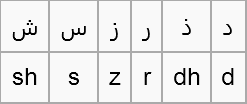
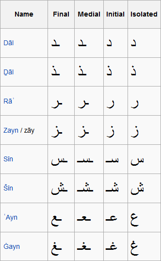

# Introduction

pdfCalligraph is an add-on module for iText 7, designed to seamlessly handle any kind of advanced shaping operations 
when writing textual content to a PDF file. Its main function is to correctly render complex writing systems 
such as the right-to-left Hebrew and Arabic scripts, 
and the various writing systems of the Indian subcontinent and its surroundings. 
In addition, it can also handle kerning and other optional features that can be provided by certain fonts for other alphabets.

In this position paper, we first provide a number of cursory introductions:
we'll start out by exploring the murky history of encoding standards for digital text, 
and then go into some detail about how the Arabic and Brahmic alphabets are structured. 
Afterwards, we will discuss the problems those writing systems pose in the PDF standard, 
and the solutions provided to these problems by iText 7's add-on pdfCalligraph.

Of course, this all serves as background information and theoretical exposition to the <a href="#using">hands-on user guide</a>.

# Technical overview

We will not be sharing revolutionary insights in this section, 
so if you are comfortable with your knowledge about character encodings, 
the Arabic alphabet, and/or the Brahmic scripts, feel free to skip these sections.

## A bit of encoding history

### Standards and deviations

For digital representation of textual data, it is necessary to store its constituents in a binary compatible way. 
Several systems were devised for representing data in a binary format even long before the digital revolution, 
the best known of which are Morse code and Braille writing. 
At the dawn of the computer age, computer manufacturers took inspiration from these systems 
to use encodings that have generally consisted of a fixed number of bits.

The most prominent of these early encoding systems is ASCII, 
a seven bit scheme that encodes upper and lower case Latin letters, numbers, punctuation marks, etc.
However, it has only 2<sup>7</sup> = 128 places and as such does not cover diacritics and accents,
other writing systems than Latin, or any symbols beyond a few basic mathematical signs.

A number of more extended systems have been developed to solve this, most prominently the concept of a code page,
which maps all possible 256 bit sequences in a single byte to a certain set of characters.
Theoretically, there is no requirement for any code page to be consistent with alphabetic orders,
or even consistency as to which types of characters are encoded (letters, numbers, symbols, etc),
but most code pages do comply with a certain implied standard regarding internal consistency.

Any international or specialized system has a multitude of these code pages, usually grouped for a certain language or script, 
e.g. Cyrillic, Turkish, or Vietnamese.
The Windows-West-European-Latin code page, for instance, encodes ASCII in the space of the first 7 bits
and uses the 8th bit to define 128 extra characters that signify modified Latin characters like É, æ, ð, ñ, ü, etc.

However, there are multiple competing standards, developed independently by companies like IBM, SAP, and Microsoft;
these systems are not interoperable, and none of them have achieved dominance at any time.
Files using codepages are not required to specify the code page that is used for their content,
so any file created with a different code page than the one your operating system expects,
may contain wrongly parsed characters or even look like complete garbage.

### Unicode 

The eventual response to this lack of a common and independent encoding was the development of Unicode,
which has become the de facto standard for systems that aren't encumbered by a legacy encoding depending on code pages,
and is steadily taking over the ones that are.

Unicode aims to provide a unique code point for every possible character, including emoji and extinct alphabets.
These code points are conventionally numbered in a hexadecimal format.
In order to keep an oversight over which code point is used for which writing systems,
characters are grouped in Unicode ranges.

* 0x0400 - 0x052F Cyrillic (304 code points)
* 0x0900 - 0x097F Devanagari (128 code points)
* 0x1400 - 0x167F Canadian Aboriginal Syllabary (640 code points)

It is an encoding of variable length, meaning that if a bit sequence (usually 1 or 2 bytes) in a Unicode text contains certain bit flags,
the next byte or bytes should be interpreted as part of a multi-byte sequence that represents one character.
If none of these flags are set, then the original sequence is considered to fully identify a character.

There are several encoding schemes, the best known of which are UTF-8 and UTF-16, which requires at least 2 bytes per character.
UTF-16 is more efficient for text that uses characters on positions 0x0800 and up e.g. all Brahmic scripts and Chinese.
For any text which is predominantly Arabic or Hebrew, there is very little difference between either system.

UTF-8 is more efficient for any text that contains Latin text, because the first 128 positions of UTF-8 are identical to ASCII.
That allows simple ASCII text to be stored in Unicode with the exact same filesize
as would happen if it were stored in ASCII encoding.

## A bit of font history

A font is a collection of mappings that links character IDs in a certain encoding with glyphs,
the actual visual representation of a character. Most fonts nowadays use the Unicode encoding standard to specify character IDs.
A glyph is a collection of vector curves that together form a shape, as follows:


As usual, there are a number of formats, the most relevant of which here are TrueType and its virtual successor OpenType.

The TrueType format was originally designed by Apple as a competitor for Type 1 fonts, at the time a proprietary specification owned by Adobe.
In 1991, Microsoft started using TrueType as its standard font format. For a long time,
TrueType was the most common font format on both Mac OS and MS Windows systems, but both companies, Apple as well as Microsoft,
added their own proprietary extensions, and soon they had their own versions and interpretations of (what once was) the standard.
When looking for a commercial font, users had to be careful to buy a font that could be used on their system.
To resolve the platform dependency of TrueType fonts, Microsoft started developing a new font format called OpenType as a successor to TrueType.
Microsoft was joined by Adobe, and support for Adobe's Type 1 fonts was added:
the glyphs in an OpenType font can now be defined using either TrueType or Type 1 technology.

OpenType adds a very versatile system called OpenType features to the TrueType specification.
Features define in what way the standard glyph for a certain character should be moved or replaced by another glyph under certain circumstances,
most commonly when they are written in the vicinity of specific other characters.
This type of information is not necessarily information inherent in the characters (Unicode points),
but must be defined on the level of the font.
It is possible for a font to choose to define ligatures that aren't mandatory or even commonly used,
e.g. a Latin font may define ligatures for the sequence 'fi', but this is in no way necessary for it to be correctly read.

TrueType is supported by the PDF format, but unfortunately there is no way to leverage OpenType features in PDF.
A PDF document is not dynamic in this way: it only knows glyphs and their positioning,
and the correct glyph IDs at the correct positions must be passed to it by the application that creates the document.
This is not a trivial effort because there are many types of rules and features, recombining or repositioning only specific characters in specific combinations.

## A bit of writing history

Over the last 5000+ years, humanity has created a cornucopia of writing systems. 
After an extended initial period of protowriting, when people tried to convey 
concepts and/or words by drawing images, a number of more abstract systems evolved. 
One of the most influential writing systems was the script developed 
and exported by the seafaring trade nation of Phoenicia.
After extended periods of time, alphabets like Greek and its descendants (Latin, Cyrillic, Runes, etc), 
and the Aramaic abjad and its descendants (Arabic, Hebrew, Syriac, etc) evolved from the Phoenician script. 
Although this is a matter of scientific debate, it is possible that the Phoenician alphabet is also 
an ancestor of the entire Brahmic family of scripts, which contains Gujarati, Thai, Telugu, 
and over a hundred other writing systems used primarily in South-East Asia and the Indian subcontinent.

The other highly influential writing system that is probably an original invention, the Han script, 
has descendants used throughout the rest of East Asia in the Chinese-Japanese-Korean spheres of influence.

## A very brief introduction to the Arabic script

Arabic is a writing system used for a large number of languages in the greater Middle East.
It is most prominently known from its usage for the Semitic language Arabic
and from that language's close association with Islam, since most religious Muslim literature is written in Arabic.
As a result, many other non-Semitic communities in and around the culturally Arabic/Muslim sphere of 
influence have also adopted the Arabic script to represent their local languages, like Farsi (Iran), Pashto (Afghanistan),
Mandinka (Senegal, Gambia), Malay (Malaysia, Indonesia), etc.
Some of these communities have introduced new letters for the alphabet, 
often based on the existent ones, to account for sounds and features not found in the original Arabic language.

Arabic is an abjad, meaning that, in principle, only the consonants of a given word will be written. 
Like most other abjads, it is 'impure' in that the long vowels (/a:/, /i:/, /u:/) are also written, 
the latter two with the same characters that are also used for /j/ and /w/. 
The missing information about the presence and quality of short vowels must be filled in by the reader; 
hence, it is usually necessary for the user to actually know the language that is written,
in order to be able to fully pronounce the written text.

Standard Arabic has 28 characters, but there are only 16 base forms:
a number of the characters are dotted variants of others.
These basic modification dots, called i'jam, are not native to the alphabet
but have been all but mandatory in writing since at least the 11th century.



Like the other Semitic abjads, Arabic is written from right to left, and does not have a distinction between upper and lower case. 
It is in all circumstances written cursively, making extensive use of ligatures to join letters together into words. 
As a result, all characters have several appearances, depending on whether or not they're being adjoined to the previous and/or next letter in the word.



This concept is easy to illustrate with a hands-on example. The Arabic word 'aniq (meaning elegant) is written with the following letters:


However, in actual writing, the graphical representation shows marked differences. 


The rightmost letter, alif, is unchanged, because by rule it does not join with any subsequent characters.
The leftmost three letters are joined to one another,
to the point where the character in the medial position is unrecognizable compared to its base form, 
save for the double dot underneath it.

It is possible to write fully vocalized Arabic, with all phonetic information available,
through the use of diacritics. This is mostly used for students who are learning Arabic,
and for texts where phonetic ambiguity must be avoided (e.g. the Qur'an).
The phonetic diacritics as a group are commonly known as tashkil;
its most-used members are the harakat diacritics for short /a/, /i/, and /u/, and the sukun which denotes absence of a vowel.

In the Unicode standard, the Arabic script is encoded into a number of ranges of code points:
* The base forms for both Standard Arabic and a number of derived alphabets in Asia are located in U+0600–U+06FF (Arabic).
* Supplemental characters, mostly for African and European languages, are in U+0750–U+077F (Arabic Supplement) and U+08A0–U+08FF (Arabic Extended-A)
* Two ranges, U+FB50–U+FDFF (Arabic Pres. Forms-A) and U+FE70–U+FEFF (Arabic Pres. Forms-B),
that define unique Unicode points for all contextual appearances (isolated, initial, medial, final) of Arabic glyphs

This last range may lead you to think that Arabic might not need OpenType features for determining the appropriate glyphs.
That is correct in a sense, and that is also the reason that iText 5 was able to correctly show non-vocalized Arabic.
However, it is much more error-proof to leverage the OpenType features for optional font divergences,
for glyphs that signify formulaic expressions, and for making a document better suited to text extraction.
You will also need OpenType features to properly show the tashkil in more complex situations.

## A very brief introduction to the Brahmic scripts

So named because of their descent from the ancient alphabet called Brahmi,
the Brahmic scripts are a large family of writing systems used primarily in India and South-East Asia.
All Brahmic alphabets are written from left to right, and their defining feature is
that the characters can change shape or switch position depending on context.
They are abugidas, i.e. writing systems in which consonants are written with an implied vowel,
usually a short /a/ or schwa, and only deviations from that implied vowel are marked.

The Brahmic family is very large and diverse, with over 100 existing writing systems. Some are used for a
single language (e.g. Telugu), others for dozens of languages (e.g. Devanagari, for Hindi, Marathi, Nepali, etc.),
and others only in specific contexts (e.g. Baybayin, only for ritualistic uses of Tagalog).
The Sanskrit language, on the other hand, can be written in many scripts, and has no 'native' alphabet associated with it.

The Brahmic scripts historically diverged into a Northern and a Southern branch.
Very broadly, Northern Brahmi scripts are used for the Indo-European languages prevalent
in Northern India, whereas Southern Brahmi scripts are used in Southern India for Dravidian languages,
and for Tai, Austro-Asiatic, and Austronesian languages in larger South-East Asia.

### Northern Brahmi

Many scripts of the Northern branch show the grouping of characters into words with the characteristic horizontal bar.


In Devanagari, one of the more prominent alphabets of the Northern Brahmi branch,
an implied vowel /a/ is not expressed in writing (#1), while other vowels take the shape of various diacritics (#2-5).
#5 is a special case, because the short /i/ diacritic is positioned to the left of its consonant,
even though it follows it in the byte string. When typing a language written in Devanagari,
one would first input the consonant and then the vowel,
but they will be reversed by a text editor that leverages OpenType featurs in any visual representation.


Another common feature is the use of half-characters in consonant clusters,
which means to affix a modified version of the first letter to an unchanged form of the second.
When typing consonant clusters, a diacritic called the halant must be inserted into the byte sequence
to make it clear that the first consonant must not be pronounced with its inherent vowel.
Editors will interpret the occurrence of halant as a sign that the preceding letter must be rendered as a half-character.


If the character accompanied by the halant is followed by a space, then the character is shown with an accent-like diacritic below (#7).
If it is not followed by a space, then a half character is rendered (#8).
As you can see, line #8 contains the right character completely, 
and also everything from the left character up until the long vertical bar. This form is known as a “half character”.

The interesting thing is that #7 and #8 are composed of the exact same characters,
only in a different order, which has a drastic effect on the eventual visual realization.
The reason for this is that the halant is used in both cases, but at a different position in the byte stream. 

### Southern Brahmi

The Southern branch shows more diversity but, in general, will show the characters as more isolated:


Some vowels will change the shape of the accompanying consonants, rather than being simple diacritical marks:


Southern Brahmi also has more of a tendency to blend clustering characters into unique forms
rather than affixing one to the other. If one of the characters is kept unchanged,
it will usually be the first one, whereas Northern Brahmi scripts will usually preserve the second one.
They use the same technique of halant, but the mutations will be markedly different.


Some scripts will also do more repositioning logic for some vowels, rather than using glyph substitutions or diacritics.


# pdfCalligraph and the PDF format

## A bit of iText history

The iText library was originally written in the context of Western European languages, 
and it was only designed to handle left-to-right alphabetic scripts. 
However, we have seen that the writing systems of the world can be much more complex and varied 
than just a sequence of letters with no interaction. 
Supporting every type of writing system that humanity has developed is a tall order, 
but we strive to be a truly global company. As such, we are determined to respond to customer requests
asking for any writing system.

In earlier versions of iText, the library was already able to render Chinese, Japanese, and Korean (CJK) glyphs in PDF documents, 
and it had limited support for the right-to-left Hebrew and Arabic scripts.
When we made attempts to go further, technical limitations,
caused by sometimes seemingly unrelated design decisions, hampered our efforts to implement this in iText 5.
Because of iText 5's implicit promise not to break backwards compatibility,
expanding support for Hebrew and Arabic was impossible: we would have needed to make
significant changes in a number of APIs to support these on all API levels.

For the Brahmic alphabets, we needed the information provided by OpenType font features;
it turned out to be impossible in iText 5 to leverage these without drastic breaks in the APIs.

When we wrote iText 7, redesigning it from the ground up,
we took care to avoid these problems in order to provide support for all font features,
on whichever level of API abstraction a user chooses.
We also took the next step and went on to create pdfCalligraph, a module that supports the elusive Brahmic scripts.

## Platform limitations

### Java

iText 7 is built with Java 7. The current implementation of pdfCalligraph depends on the enum class `java.lang.Character.UnicodeScript`, which is only available from Java 7 onwards. iText 7 of course uses some of the other syntax features that were new in this release, so users will have no option
to build from source code for older versions, and will have to build their own application on Java 7 or newer.

### .NET Framework

iText 7 is built with .NET Framework version 4.0. It uses a number of concepts that preclude backporting, such as LINQ and Concurrent Collections.

## PDF limitations

PDF, as a format, is not designed to leverage the power of OpenType fonts.
It only knows the glyph ID in a font that must be rendered in the document,
and has no concept of glyph substitutions or glyph repositioning logic.
In a PDF document, the exact glyphs that make up a visual representation must be specified:
the Unicode locations of the original characters - typical for most other formats that can provide visual rendering -
are not enough.

As an example, the word "Sanskrit" is written in Hindi as follows with the Devanagari alphabet:


However, it is saved in Unicode byte stream as follows:

<table
 style='table-layout:fixed;width:366pt'>
 <tr>
  <td style='height:36.75pt;width:48pt'>character</td>
  <td style='width:70pt'>default meaning</td>
  <td style='width:68pt'>Unicode point</td>
  <td style='width:191pt'>comments</td>
 </tr>
 <tr style='height:31.5pt'>
  <td style='height:31.5pt'>&#2360;</td>
  <td>sa</td>
  <td>0938</td>
  <td></td>
 </tr>
 <tr style='height:31.5pt'>
  <td style='height:31.5pt'>&#2306;</td>
  <td>m</td>
  <td>0902</td>
  <td>nasalisation (diacritic)</td>
 </tr>
 <tr style='height:31.5pt'>
  <td style='height:31.5pt'>&#2360;</td>
  <td>sa</td>
  <td>0938</td>
  <td></td>
 </tr>
 <tr style='height:31.5pt'>
  <td style='height:31.5pt'>&#2381;</td>
  <td>halant</td>
  <td>094D</td>
  <td>drops inherent a of previous consonant</td>
 </tr>
 <tr style='height:31.5pt'>
  <td style='height:31.5pt'>&#2325;</td>
  <td>ka</td>
  <td>0915</td>
  <td></td>
 </tr>
 <tr style='height:31.5pt'>
  <td style='height:31.5pt'>&#2371;</td>
  <td>r</td>
  <td>0943</td>
  <td>vocalic r (diacritic) replaces inherent a</td>
 </tr>
 <tr style='height:31.5pt'>
  <td style='height:31.5pt'>&#2340;</td>
  <td>ta</td>
  <td>0924</td>
  <td></td>
 </tr>
</table>

When this string of Unicode points is fed to a PDF creator application that doesn't leverage OTF features,
the output will look like this:


The PDF format is able to resolve the diacritics as belonging with the glyph they pertain to,
but it cannot do the complex substitution of sa + halant + ka.
It also places the vocalic r diacritic at an incorrect position relative to its parent glyph.

### Text extraction and searchability

A PDF document does not necessarily know which Unicode characters are represented by the glyphs it has stored.
This is not a problem for rendering the document with a viewer, but may make it harder to extract text.
A font in a PDF file can have a ToUnicode dictionary, which will map glyph IDs to Unicode characters or sequences.
However, this mapping is optional, and it's necessarily a one-to-many relation so it cannot handle some of the complexities of Brahmic alphabets, which would require a many-to-many relation.

Due to the complexities that can arise in certain glyph clusters, it may be impossible to retrieve the actual Unicode sequence.
In this case, it is possible in PDF syntax to specify the correct Unicode code point(s) that are being shown by the glyphs,
by leveraging the PDF marked content attribute /ActualText.
This attribute can be picked up by a PDF viewer for a text extraction process (e.g. copy-pasting contents) or searching for specific text;
without this, it is impossible to retrieve the contents of the file correctly.

## Support

The initial release of pdfCalligraph provided support for the following scripts:

* Arabic, except tashkil
* Devanagari, used for Hindi, Marathi, Sindhi, etc
* Tamil
* Hebrew - only requires pdfCalligraph for right-to-left writing

The second release, version 1.0.1, expanded this support to:

* Arabic, including tashkil
* Gurmukhi, used for writing Punjabi
* Kannada

pdfCalligraph 1.0.2, as of yet unreleased, will also support:
* Odia/Oriya
* Telugu
* Bengali
* Malayalam
* Gujarati
* Thai

The Thai writing system does not contain any transformations in glyph shapes, so it only requires pdfCalligraph functionality for diacritics.

<a name="using"></a>
## Using pdfCalligraph
### Configuration

Using pdfCalligraph is exceedingly easy: you just load the correct binaries into your project, 
make sure your valid license file is loaded, 
and iText 7 will automatically use the pdfCalligraph code when text instructions are encountered 
that contain Indic texts, or a script that is written from right to left.

The iText layout module will automatically look for the pdfCalligraph module in its dependencies
if Brahmic or Arabic text is encountered by the Renderer Framework.
If pdfCalligraph is available, iText will call its functionality
to provide the correct glyph shapes to write to the PDF file.
However, the typography logic consumes resources even for documents that don't need any shaping operations.
This would affect all users of the document creation software in iText,
including those who only use iText for text in writing systems that don't need OpenType,
like Latin or Cyrillic or Japanese.
Hence, in order to reduce overhead, iText will not attempt any advanced shaping operations
if the pdfCalligraph module is not loaded as a binary dependency.

Instructions for loading dependencies can be found on http://developers.itextpdf.com/itext-7 . The exact modules you need are:

* the pdfCalligraph library itself
* the license key library

### Using the high-level API

pdfCalligraph exposes a number of APIs so that it can be reached from the iText Core code,
but these APIs do not have to be called by code in applications that leverage pdfCalligraph.

This code will just work - note that we don't even have to specify which writing system is being used:

```java
// initial actions
LicenseKey.loadLicenseFile("/path/to/license.xml");
Document arabicPdf = new Document(new PdfDocument(new PdfWriter("/path/to/output.pdf")));

// create a font, and make it the default for the document
PdfFont f = PdfFontFactory.createFont("/path/to/arabicFont.ttf");
arabicPdf.setFont(f);

// add content: السلام عليكم (as-salaamu 'aleykum - peace be upon you)
arabicPdf.add(new Paragraph("\u0627\u0644\u0633\u0644\u0627\u0645 \u0639\u0644\u064A\u0643\u0645"));

arabicPdf.close();
```

iText will only attempt to apply advanced shaping in a text on the characters in the alphabet that constitutes a majority
[footnote: technically, the plurality https://en.wikipedia.org/wiki/Plurality_(voting) ] 
of characters of that text. This can be overridden by explicitly setting the script for a layout element.
This is done as follows:

```java
PdfFont f = PdfFontFactory.createFont("/path/to/unicodeFont.ttf", PdfEncodings.IDENTITY_H, true);
String input = "The concept of \u0915\u0930\u094D\u092E (karma) is at least as old as the Vedic texts.";

Paragraph mixed = new Paragraph(input);
mixed.setFont(f);
mixed.setProperty(Property.FONT_SCRIPT, Character.UnicodeScript.DEVANAGARI);
```

iText will of course fail to do shaping operations with the Latin text,
but it will correctly make the र (ra) into the combining diacritic form it assumes in consonant clusters.

However, this becomes more problematic when mixing two alphabets that both require pdfCalligraph logic.
You are also less likely to find fonts that provide full support for the alphabets you need.
Therefore, it is generally wiser to separate the contents, when they appear in a single paragraph,
into a number of Text layout objects. This can be automated with basic logic:

```java
TODO: see what FontSelector code sample should look like
```

It is also trivial to enable kerning, the OpenType feature which lets fonts define custom rules
for repositioning glyphs in Latin text to make it look more stylized.
You can simply specify that the text you're adding must be kerned, and pdfCalligraph will do this under the hood.

```java
PdfFont f = PdfFontFactory.createFont("/path/to/kernedFont.ttf", PdfEncodings.IDENTITY_H, true);
String input = "WAVE";

Paragraph kerned = new Paragraph(input);
kerned.setFont(f);
kerned.setProperty(Property.FONT_KERNING, FontKerning.YES);
```


### Using the low-level API

Users who are using the low-level API can also leverage OTF features by using the `Shaper`.
The API for the `Shaper` class is subject to modifications because pdfCalligraph is still a young product,
and because it was originally not meant to be used by client applications.
For those reasons, the entire class is marked as `@Deprecated` or `[Obsolete]`,
so that users know that they should not yet expect backwards compatibility or consistency in the API or functionality.

Below is the default way of adding content to specific coordinates.
However, this will give incorrect results for complex alphabets.

```java
// initializations
int x, y, fontsize;
String text;
PdfCanvas canvas = new PdfCanvas(pdfDocument.getLastPage());

PdfFont font = PdfFontFactory.createFont("/path/to/font.ttf", PdfEncodings.IDENTITY_H);

canvas.saveState()
        .beginText()
        .moveText(x, y)
        .setFontAndSize(font, fontsize)
        .showText(text) // String argument
        .endText()
        .restoreState();
```

In order to leverage OpenType features, you need a `GlyphLine`,
which contains the font's glyph information for each of the Unicode characters in your String.
Then, you need to allow the `Shaper` class to modify that `GlyphLine`,
and pass the result to the `PdfCanvas#showText` overload which accepts a GlyphLine argument.

Below is a code sample that will work as of iText 7.0.1 and pdfCalligraph 1.0.2.

```java
// initializations
int x, y, fontsize;
String text;
Character.UnicodeScript script = Character.UnicodeScript.TELUGU; // replace with the alphabet of your choice
PdfCanvas canvas = new PdfCanvas(pdfDocument.getLastPage());

// once for every font
TrueTypeFont ttf = new TrueTypeFont("/path/to/font.ttf");
PdfFont font = PdfFontFactory.createFont(ttf, PdfEncodings.IDENTITY_H);

// once for every line of text
GlyphLine glyphLine = font.createGlyphLine(text);
Shaper.applyOtfScript(ttf, glyphLine, script);

canvas.saveState()
        .beginText()
        .moveText(x, y)
        .setFontAndSize(font, fontsize)
        .showText(glyphLine) // GlyphLine argument
        .endText()
        .restoreState();
```

Users who want to leverage optional ligatures in Latin text through the low-level API can do the exact same thing for their text. The only difference is that they should call another method from Shaper:

```java
Shaper.applyLigaFeature(ttf, glyphLine, null); // instead of .applyOtfScript()
```


If you want to enable kerning with the low-level API, you can simply call the `applyKerning` method with similar parameters as before:

```java
Shaper.applyKerning(ttf, glyphLine);
```

# Colophon

The fonts used for the examples are:
* FoglihtenNo07 for Latin text
* Arial Unicode MS for Arabic text
* specialized Noto Sans fonts for the texts in the Brahmic scripts

Image of number 2 was taken from the FontForge visualisation of the glyph metrics of LiberationSerif-Regular
Arabic tabular images were taken from Wikipedia
