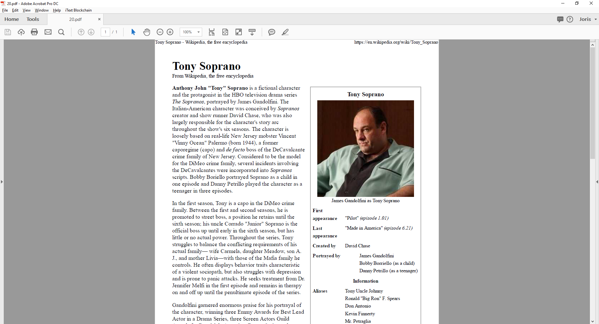
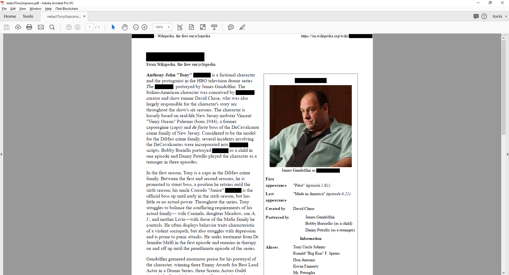

# pdfSweep: A brief introduction

## Introduction

pdfSweep is an iText plugin that removes (redacts) sensitive information from a PDF (Portable Document Format) document. 
Confidentiality is assured, because the redacted information cannot be recovered. 
In a secure two-step process, pdfSweep deletes text and images at user-defined coordinates, or as defined by a regular expression. 
After having parsed the rendering information in the original PDF document, a new PDF document is created without the redacted content.

## Why do we need redaction?

Redaction can be useful whenever the publisher or author of a document wishes to take out certain information. Common usecases include;

* Freedom of Information Act
* General Data Protection Regulation
* Government declassification procedures
* Data that would endanger the privacy of others
    * Social security numbers
    * Phone numbers
    * Bank account details
    * Name/Firstname of people in a clinical trial
* Proprietary information
* Trade secrets
* ..

## An example

The basic pdfSweep workflow has just two easy steps:

* Select those parts of the document that you prefer to have redacted. 
Either by specifying the coordinates, or by inputting a regular expression that fits your needs.
We have already provided a substantial list of common regular expressions to do some of the heavy lifting for you, such as;
social security numbers, phone numbers, dates, etc

* Pass the locations to pdfSweep

This is an autosweep example that redacts the words 'Tony Soprano' and 'Soprano' and 'Sopranos' (regardless of casing).
It marks all occurences of these words with a black rectangle.

**Figure 1**: pdfsweep original input document

And this is after redaction:

**Figure 2**: pdfsweep redacted output document

## Conclusion

In this blogpost, we've briefly presented our addon pdfSweep. PdfSweep allows you to seamlessly integrate data redaction in your existing workflow. Redaction rectangles have to be defined, either by using pdfAutoSweep which uses regular expressions to search for matching text and coordinates, or by programmatically enterting the coordinates. PdfSweep will redact both text, images and metadata ensuring complete confidentiality.

Learn more at www.itextpdf.com