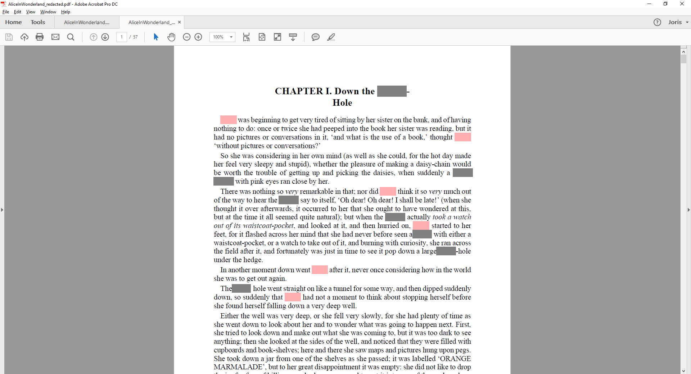

# pdfSweep: A brief introduction

## Introduction

pdfSweep is an iText plugin that removes (redacts) sensitive information from a PDF (Portable Document Format) document. 
Confidentiality is assured, because the redacted information cannot be recovered. 
In a secure two-step process, pdfSweep deletes text and images at user-defined coordinates, or as defined by a regular expression. 
After having parsed the rendering information in the original PDF document, a new PDF document is created without the redacted content.

## Why do we need redaction?

* Freedom of Information Act
* Government declassification procedures
* Data that would endanger the privacy of others
    * Social security numbers
    * Phone numbers
    * Bank account details
    * Name/Firstname of people in a clinical trial
* Proprietary information
* Trade secrets
* ..

## A short history of redaction

In the past redaction meant printing a document, blacking out the necessary information and making a photocopy of the document. That way, any information that is covered by dark ink simply does not get copied. This worked because paper is a WYSIWYG format. There is no hidden data, no metadata that needs to be erased.


**Figure 0**: Example redacted document

A .pdf document contains instructions for rendering the document in a viewer. Adding an instruction to draw a black rectangle does not erase text-rendering instructions underneath the rectangle.
This essentially means that covering up information no longer works, and actual removal/replacement is needed. Otherwise text-extraction (or simply copy/pasting the text from your viewer to a text editor) would yield the redacted data.

## Challenges in redacting pdf documents

Redacting a pdf document is significantly harder that simply covering up the data that is to be redacted.
* Text rendering instructions do not need to appear in logical (reading) order
* Text rendering instructions do not always constitute complete words/chunks of text
* Transformations can be applied (shift, scale, font transformation, etc)
* Pdf documents can contain metadata, which should also be checked.
* Pdf documents can contain scripts. Thus adding the possibility of dynamic content.

This is an example of raw PDF document. It tells the viewer to render the text "Appearance" and "Pilot"

```java
[a, -28.7356, p, 27.2652, p, 27.2652, e, -27.2652, a, -28.7356, r, 64.6889, a, -28.7356, n, 27.2652, c, -38.7594, e, 444] TJ
/R10 10.44 Tf
68.16 0.24 Td
[", 17.1965, P, -18.7118, i, -9.35592, l, -9.35592, o, -17.2414, t, -9.35636, ", 17.1965,  , 250] TJ
```

Similar problems occur with images:
* Images can be defined as a series of drawing operations
* pdfSweep has to process all instructions and find where each shape intersects with the redaction rectangle. And has to find a neat way to avoid drawing in that rectangle.
* Images can be added to a pdf document under many formats. Only formats that iText can support can sensibly be redacted.

## An example

The pdfSweep workflow has just two easy steps:

* Select those parts of the document that you prefer to have redacted. 
Either be specifying the coordinates, or by inputting a regular expression that fits your needs.
We have already provided a substantial list of common regular expressions to do some of the heavy lifting for you, such as;
social security numbers, phone numbers, dates, etc

* Once a strategy has been defined, any document that matches this template can be redacted. Simply pass the locations to pdfSweep, or invoke pdfAutoSweep with the pattern(s) of your choice.

```java

// load the license needed to be able to run pdfSweep
LicenseKey.loadLicenseFile(licenceFile);

// set input and output file
String input = "AliceInWonderland.pdf";
String output = "AliceInWonderland_redacted.pdf";

// define a strategy
CompositeLocationExtractionStrategy strategy = new CompositeLocationExtractionStrategy();			// a Composite strategy acts as a collection of other strategies
strategy.add(new PatternLocationExtractionStrategy("Alice").setRedactionColor(Color.PINK));                                       // redact all occurences of the word 'Alice' with a pink marker
strategy.add(new PatternLocationExtractionStrategy("((w|W)hite (r|R)abbit)|( rabbit)|(Rabbit)").setRedactionColor(Color.GRAY));   // redact all occurences of 'White Rabbit' (with some variations on case) with a gray marker

// load the document
PdfDocument pdf = new PdfDocument(new PdfReader(input), new PdfWriter(output));

// sweep
PdfAutoSweep autoSweep = new PdfAutoSweep(composite);
autoSweep.cleanUp(pdf);

// close the document
pdf.close();
```

This is the original document:


**Figure 1**: pdfsweep original input document

And this is after redaction:


**Figure 2**: pdfsweep redacted output document

As is made clear by this example document (and the code to go with it), it is perfectly possbile to define a custom color for each snippet of text to be redacted.

## How does it work?

1. The end user can specify a regular expression, and optionally a color
2. The document is processed a first time, all instructions in the .pdf document that relate to text rendering are processed. All characters along with their bounding rectangles in the document are stored.
3. These intermediate datastructures are sorted so that all characters are now in logical (reading) order.
4. The regular expression(s) provided by the user are matched.
5. The information about where the match took place, and the bounding rectangles of the characters involved provide pdfSweep with the rectangles that need to be redacted.


**Figure 3**: pdfAutoSweep workflow

## Performance

To give a brief idea of the performance of pdfSweep, we've used the iPhone user manual as a reference. We've redacted the regular expression "(i|I)Phone". You can imagine this occurs quite a lot in that particular document.

Here are the results
| copies |	#pages | #Mb  | #Ms   |
|--------|---------|------|-------|
| 1	     | 130     | 3.23 |	6407  |
| 2	     | 260     | 5.55 |	10253 |
| 4	     | 520	   | 11.1 | 17946 |
| 8      | 1040    | 22.5 | 23445 |

Where "copies" signifies howmany times the original input document was concatenated with itself. E.g. 4 copies means the document (of 130 pages) was concatenated 4 times (resulting in 520 pages).
From this table we can clearly see pdfSweep performs linearly in relation to the size of the input document.

