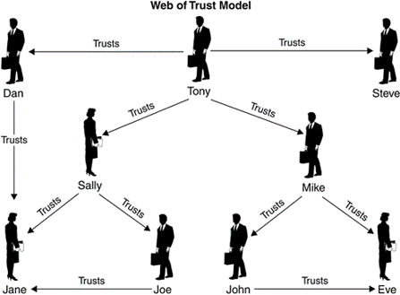
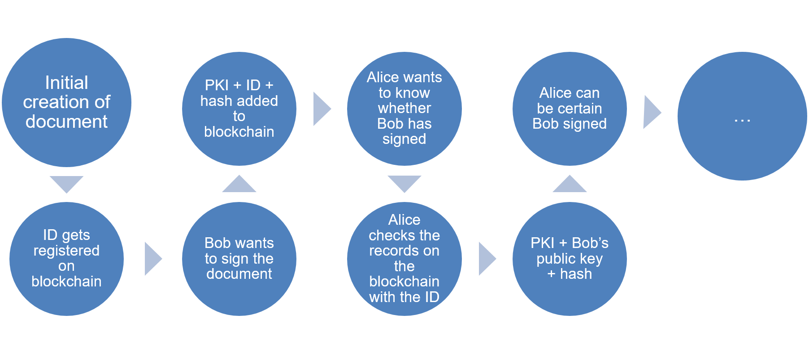

# Blockchains

A blockchain is a distributed database that is used to maintain a continuously growing list of records, called blocks. 
Each block contains a timestamp and a link to a previous block. 
A blockchain is typically managed by a peer-to-peer network collectively adhering to a protocol for validating new blocks. 
By design, blockchains are inherently resistant to modification of the data. 
Once recorded, the data in any given block cannot be altered retroactively without the alteration of all subsequent blocks and a collusion of the network majority. 
Functionally, a blockchain can serve as "an open, distributed ledger that can record transactions between two parties efficiently and in a verifiable and permanent way. 
The ledger itself can also be programmed to trigger transactions automatically." (wikipedia)


## Why should you use it:

A blockchain supersedes older technology that deals with authentication and non-repudiation.
First, there are many ways you can sign a document.
Typically by "signing" we mean creating a hash of a document and storing it.
With a blockchain, the useful part is that once such a hash is stored, it can not be changed or deleted. This gives you two advantages:

1. the hash itself identifies the file from which it was computed.
2. the fact that your hash is in the blockchain gives you a point in time when the operation was done.

Later you can say: 
"Hey, I've created this hash on 10 Oct 2016: here is the transaction in the blockchain which contains the hash. I've created it according to this formula from this file. "
Now any person can take your file and compute the hash again and verify that it matches the one stored in the blockchain. 
All this works because:

1. it is very easy to compute the hash from a file but very difficult to craft a similar file which will produce exactly the same hash.
2. it is practically impossible to change the data stored inside blockchain.
3. every transaction in the blockchain has a timestamp, so having the transaction we know exactly when it was done.

## Basic concepts

Intuitively, a blockchain holds data. It collects this data in units called 'blocks'. 
There is a mechanism to prove a block has not been tampered with. And over time, blocks get chained together. This chaining organically enables a kind of 'history'.

### Hashing

A cryptographic hash function allows one to easily verify that some input data maps to a given hash value. 
But if the input data is unknown, it is deliberately difficult to reconstruct it (or equivalent alternatives) by knowing the stored hash value. 
This is used for assuring integrity of transmitted data. (wikipedia)

Even a small change in the message will (with overwhelming probability) result in a mostly different hash, due to the avalanche effect. 
For example, adding a period to the end of this sentence changes almost half (111 out of 224) of the bits in the hash:

 ````
SHA224("The quick brown fox jumps over the lazy dog")
0x 730e109bd7a8a32b1cb9d9a09aa2325d2430587ddbc0c38bad911525
SHA224("The quick brown fox jumps over the lazy dog.")
0x 619cba8e8e05826e9b8c519c0a5c68f4fb653e8a3d8aa04bb2c8cd4c
 ````
 

 
One iteration in a SHA-2 family compression function. The blue components perform bitwise operations such as logical AND, OR, XOR and bitshift.
The bitwise rotation uses different constants for SHA-512.
The red box is addition modulo 2^32 for SHA-256, or 2^64 for SHA-512.
 
### Encryption

The public and private key pair comprise of two uniquely related cryptographic keys (basically long random numbers). 
The public key is what its name suggests - public. It is made available to everyone via a publicly accessible repository or directory. 
On the other hand, the private key must remain confidential to its respective owner.

Because the key pair is mathematically related, whatever is encrypted with a public key may only be decrypted by its corresponding private key and vice versa.
For example, if Bob wants to send sensitive data to Alice, and wants to be sure that only Alice may be able to read it, he will encrypt the data with Alice's public key. 
Only Alice has access to her corresponding private key and as a result is the only person with the capability of decrypting the encrypted data back into its original form.

As only Alice has access to her private key, it is possible that only Alice can decrypt the encrypted data. 
Even if someone else gains access to the encrypted data, it will remain confidential as they should not have access to Alice's private key.
Public Key Cryptography can therefore achieve confidentiality. However another important aspect of Public Key Cryptography is its ability to create a digital signature.

A digital signature is a code (generated and authenticated by public key encryption) which is attached to an electronically transmitted document to verify its contents and the sender's identity.

When users interact with a signed document they can be assured of:
- Content Source: End users can confirm that the software really comes from the publisher who signed it.
- Content Integrity: End users can verify that the software has not been modified since it was signed.

### Web of trust

In cryptography, a web of trust is a concept to establish the authenticity of the binding between a public key and its owner.
Essentially, it answers the question "When Alice sends me her public key, how do I know that this really belongs to the physical Alice I know?" 
Because any imposter could give me their key, and claim to be Alice. Or, to put it simply, this solves problems related to identity.
This maps nicely to the concept of a Certificate Authority (CA) which will be discussed later.

In a web of trust context, there are again public and private keys.
Public keys are accessible to everyone, like a phone-book. 
Everyone can look up Alice’s public key. 
Multiple people can of course claim to be Alice. 

But other records can be added as well. 
People can vouch for Alice and declare that they trust a particular combination of identity and key. 
Let’s assume Bob wants to vouch for Alice. 
He can look up her public key. He then signs her public key with his private key, and puts a record on the blockchain. 

Now everyone can use Bob’s public key to decrypt that information. 
They can verify that (at a certain point in time) Bob made the effort of using his private key to digitally sign Alice’s public key. 
Because Bob is the only person supposed to know Bob’s key, this is condered as “Bob trusts Alice”

By adding an extra status field (similar to ACK and NACK in the TCP protocol) we an enable Bob to revoke his trust in Alice. (Since blockchains do not allow deletion of records.)

By having a flexible mechanism where trust is delegated to the end-users, rather than a centralized authority, applications built on top of this backbone can be flexible as well.
It enables applications to work with various degrees or modes of trust:
- Alice is trusted by the bank, she must be trustworthy
- Alice is trusted by at least 60% of all the people Bob trusts
- Alice is not trusted by the governments
- etc



## Relation to pdf

Pdf documents can be digitally signed.

- this requires a Certificate Authority,
- and a centralized timeserver.
- Documents can not be signed in parallel,
- and signatures live in the document.

A certificate authority or certification authority (CA) is an entity that issues digital certificates. 
A digital certificate certifies the ownership of a public key by the named subject of the certificate. 
This allows others (relying parties) to rely upon signatures or on assertions made about the private key that corresponds to the certified public key. 
A CA acts as a trusted third party - trusted both by the subject (owner) of the certificate and by the party relying upon the certificate. 
A common use is in issuing identity cards by national governments for use in electronically signing documents.

## Opportunities

## Theoretical usecase - high level



On a high level, the idea is to separate the functionality of signing and integrity from a pdf, and bring those into the blockchain.
Imagine an example usecase. 

1. 	The document is created, and the document ID (along with its hash, and the name of the hashing algorithm) gets put on a public blockchain. 
	This does not cause any problems, since the hash typically does not allow you to rebuild the entire document. 
	We put the hashing algorithm on the chain as well to ensure long term validation.  
	
2.	Now imagine that this document is an invoice. 
	Bob has had some work done on his house, and the renovation company sends him an invoice.  
	
3.	Bob wants to sign the invoice to indicate he agrees with the price and will pay. 
	Bob's private key is then used to encrypt the hash-value of the document. 
	This signature (comprising the ID of the document, the original hash-value, the signed hash-value, as well as the names of the hashing algorithm and signing algorithm) are stored on the blockchain.  

4.	Alice, who works for the renovation company wants to check whether Bob has signed already. 
	She can easily look up all records on the blockchain for a given ID (the document ID). 
	One of these records ought to be the record Bob created earlier.  
	
	Since the record contains the original hash, and the names of all the algorithms involved, Alice can (using Bob's public key) verify 2 things:
	- it was Bob that signed (hash + signed hash + private key)
	- Bob signed the exact document she sent him (ID + hash)

## Theoretical usecase - low level

### Implementation

The interfaces we impose on blockchain implementations are minimal, yet they provide us with the needed abstraction to enable us to build complex applications and workflows on top of them.
We abstract a blockchain as a multimap, allowing end-users to store an object (represented by Record, which is `HashMap<String, Object>`) and tying it to a key (String).

```java
public interface IBlockChain {

    /**
     * Put data on the blockchain
     *
     * @param key  the key being used to put the data on the blockchain
     * @param data the data being put on the blockchain
     */
    public boolean put(String key, Record data);

    /**
     * Get data from the blockchain
     *
     * @param key the key being queried
     * @return
     */
    public List<Record> get(String key);

    /**
     * Get all data from the blockchain
     * @return
     */
    public List<Record> all();
}
```

### Concrete implementation using JSON-RPC and MultiChain

As a proof of concept we have provided an implementation of the interface IBlockchain using JSON-RPC (remote procedure call) and MultiChain.
If you want to learn more about setting up a blockchain instance with MultiChain, check out their website for more resources.
In particular the getting started guide at https://www.multichain.com/getting-started/.

### Example(s)

1. Putting a document on the blockchain

```java
	// define a multichain instance
	IBlockChain mc = new MultiChain(
                "http://127.0.0.1",                                  // address of another node on the chain
                4352,                                                // port
                "chain1",                                            // name of the blockchain
                "stream1",                                           // name of the stream
                "multichainrpc",                                     // username
                "BHcXLKwR218R883P6pjiWdBffdMx398im4R8BEwfAxMm");     // password

	// provide the details about signing and hashing
	sign.AbstractExternalSignature sgn = new sign.DefaultExternalSignature(new File("path_to_keystore"), "demo", "password");

	// file being handled
	File inputFile = new File("input.pdf");

	// instantiate blockchain
	pdfchain.PdfChain blockchain = new pdfchain.PdfChain(mc, sgn);
	
	blockchain.put(inputFile);
```

2. Retrieving document information from the blockchain

```java
	IBlockChain mc = new MultiChain(
                "http://127.0.0.1",
                4352,
                "chain1",
                "stream1",
                "multichainrpc",
                "BHcXLKwR218R883P6pjiWdBffdMx398im4R8BEwfAxMm");

	sign.AbstractExternalSignature sgn = new sign.DefaultExternalSignature(new File("path_to_keystore"), "demo", "password");

	File inputFile = new File("input.pdf");

	pdfchain.PdfChain blockchain = new pdfchain.PdfChain(mc, sgn);
	for (Map<String, Object> docEntry : blockchain.get(inputFile)) {
		for (Map.Entry<String, Object> entry : docEntry.entrySet())
			System.out.println(padRight(entry.getKey(), 32) + " : " + entry.getValue());
		System.out.println("");
	}
```

```java
blocktime                        : 1499691151
id2                              : ????B?}?`?-o?R
id1                              : z?L{?Wd=????G?
publishers                       : [14pwDpkcfRvSiw6DJWpP7RdcYgv5NfRRn6Dudr]
txid                             : b0092d7eb967ac2e45671742ddf1a0a96bc049a4bbfe3528888b6d9ff396b7a2
hsh                              : ??B??????o?$'?A?d??L???xR?U
confirmations                    : 22
key                              : ��B��ï¿½ï¿½ï¿½È o�$'�A�d��L���xR�U
shsh                             : <garbled>
```

## Usecase - port of Antwerp

The port of Antwerp, largest port of Belgium and second largest port of Europe in terms of container-capacity is 
experimenting with blockchain-technology for the automation of logistics. This way, the port aims to speed up the many interactions between clients and stakeholders.
They also aim to reduce the cost. Not just the cost of the enormous papertrail, but also price-fluctuations not being communicated clearly, a dollar to euro conversion not having been fixed, or a bill-of-laden mismatch.

Transporting even a single container will include a minimum of 30 different parties. Going from the truck-drivers that delivered the goods that went into the container, to the people loading the container, the people taking the goods out of the container, as well as the harbormaster. Communication between all these parties occurs over a wide variety of platforms and media. Email, fax, phone being the most common ones. It’s no surprise that information gets lost or distorted along the way.

Security is the largest issue. In order to ensure containers can only be moved and opened by the correct people, they are often locked with a code. 
The code has to pass through all the communication-channels mentioned above. Most of them are insecure. 
Containers often go missing, their content stolen. 
And because the container isn’t continuously tracked, nobody can be blamed for its disappearance.

This is where blockchains provide the perfect fit. A single source of truth (the bill of laden) can be passed and signed (as a token) between all parties. 
This offers stakeholders a way of tracking the container in real time. 
It also enables stakeholders to see where the container went missing, and under who's responsibility.

## Why work with us?

### with regards to pdf

We know that a lot of companies are currently looking into blockchain technology.
So why would you chose to work with iText?

- We are proven PDF experts.
- We have upwards of 20 years of experience with PDF related software.
- We are Members of ISO committee that sets PDF standards.

### with regards to blockchain

- We have invested a substantial amount of time in investigating blockchain technology.
- We are in the process of aquiring patents with regards to blockchain-PDF interaction.
- We have many useful contacts with startups.
- These startups typically offer a mutually beneficial cooperation, they learn about the possibilities of PDF documents. And we learn about how blockchain can be used in new and exciting ways.

## The hype