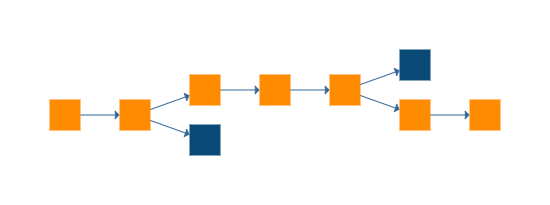
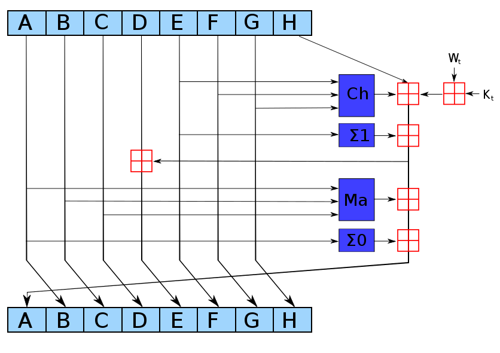

# Blockchains

A blockchain is a distributed database that is used to maintain a continuously growing list of records, called blocks. 
Each block contains a timestamp and a link to a previous block. 
A blockchain is typically managed by a peer-to-peer network collectively adhering to a protocol for validating new blocks. 
By design, blockchains are inherently resistant to modification of the data. 
Once recorded, the data in any given block cannot be altered retroactively without the alteration of all subsequent blocks and a collusion of the network majority. 
Functionally, a blockchain can serve as "an open, distributed ledger that can record transactions between two parties efficiently and in a verifiable and permanent way. 
The ledger itself can also be programmed to trigger transactions automatically." (wikipedia)



## Why should you use it:

A blockchain supersedes older technology that deals with authentication and non-repudiation.
First, there are many ways you can sign a document.
Typically by "signing" we mean creating a hash of a document and storing it.
With a blockchain, the useful part is that once such a hash is stored, it can not be changed or deleted. This gives you two advantages:

1. the hash itself identifies the file from which it was computed.
2. the fact that your hash is in the blockchain gives you a point in time when the operation was done.

Later you can say: 
"Hey, I’ve created this hash on 10 Oct 2016: here is the transaction in the blockchain which contains the hash. I’ve created it according to this formula from this file. "
Now any person can take your file and compute the hash again and verify that it matches the one stored in the blockchain. 
All this works because:

1. it is very easy to compute the hash from a file but very difficult to craft a similar file which will produce exactly the same hash.
2. it is practically impossible to change the data stored inside blockchain.
3. every transaction in the blockchain has a timestamp, so having the transaction we know exactly when it was done.

## Basic concepts

Intuitively, a blockchain holds data. It collects this data in units called “blocks”. 
There is a mechanism to prove a block has not been tampered with. And over time, blocks get chained together. This chaining organically enables a kind of “history”.

### Hashing

A cryptographic hash function allows one to easily verify that some input data maps to a given hash value. 
But if the input data is unknown, it is deliberately difficult to reconstruct it (or equivalent alternatives) by knowing the stored hash value. 
This is used for assuring integrity of transmitted data. (wikipedia)

Even a small change in the message will (with overwhelming probability) result in a mostly different hash, due to the avalanche effect. 
For example, adding a period to the end of this sentence changes almost half (111 out of 224) of the bits in the hash:

 ````
SHA224("The quick brown fox jumps over the lazy dog")
0x 730e109bd7a8a32b1cb9d9a09aa2325d2430587ddbc0c38bad911525
SHA224("The quick brown fox jumps over the lazy dog.")
0x 619cba8e8e05826e9b8c519c0a5c68f4fb653e8a3d8aa04bb2c8cd4c
 ````
 

 
### Encryption

The public and private key pair comprise of two uniquely related cryptographic keys (basically long random numbers). 
The public key is what its name suggests - public. It is made available to everyone via a publicly accessible repository or directory. 
On the other hand, the private key must remain confidential to its respective owner.

Because the key pair is mathematically related, whatever is encrypted with a public key may only be decrypted by its corresponding private key and vice versa.
For example, if Bob wants to send sensitive data to Alice, and wants to be sure that only Alice may be able to read it, he will encrypt the data with Alice's public key. 
Only Alice has access to her corresponding private key and as a result is the only person with the capability of decrypting the encrypted data back into its original form.

As only Alice has access to her private key, it is possible that only Alice can decrypt the encrypted data. 
Even if someone else gains access to the encrypted data, it will remain confidential as they should not have access to Alice's private key.
Public Key Cryptography can therefore achieve confidentiality. However another important aspect of Public Key Cryptography is its ability to create a digital signature.

A digital signature is a code (generated and authenticated by public key encryption) which is attached to an electronically transmitted document to verify its contents and the sender's identity.

When users interact with a signed document they can be assured of:
- Content Source: End users can confirm that the software really comes from the publisher who signed it.
- Content Integrity: End users can verify that the software has not been modified since it was signed.

### Web of trust

## Relation to pdf

## Opportunities

## Theoretical usecase - high level

## Theoretical usecase - low level

## Usecase - port of Antwerp

## Why work with us?

### with regards to pdf

### with regards to blockchain

## The hype