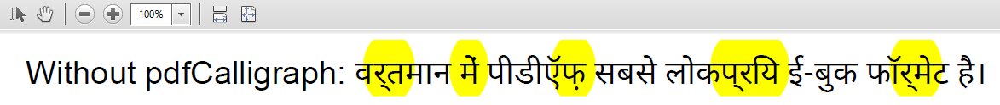
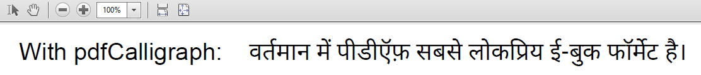

# PDF

Your business is global, shouldn't your documents be, too?
The PDF format does not make it easy to support certain alphabets,
but now, with the help of iText and pdfCalligraph, we are on our way to truly making PDF a global format.

iText Software has overcome the challenge of creating Arabic and Indic documents:
pdfCalligraph is an add-on module for iText 7, specially designed to correctly render complex writing systems.
pdfCalligraph will work seamlessly with any existing iText 7 code, only requiring the bare minimum in configuration.
The output documents are fully searchable, and text can correctly be extracted with the right tools.

## Technical background

OpenType features are a very versatile system for making fonts dynamic.
Features define in what way the standard glyph for a certain character should be moved or replaced by another glyph under certain circumstances,
most commonly when they are written in the vicinity of specific other characters.
Fonts need to make heavy use of OpenType features in order to implement any of the Brahmic scripts.

PDF, as a format, is not designed to leverage the power of OpenType fonts.
It only knows the glyph ID in a font that must be rendered in the document,
and has no concept of glyph substitutions or glyph repositioning logic.
Correctly processing Indic text into a PDF requires specialized tools that will do preprocessing of the text, using OpenType features.

In earlier versions of iText, the library was already able to render Chinese, Japanese,
and Korean (CJK) glyphs in PDF documents, and it had limited support for Arabic.
For the Brahmic alphabets, we needed the information provided by OpenType font features.
When we wrote iText 7, redesigning it from the ground up,
we took care to avoid these problems in order to provide support for all font features,
on whichever level of API abstraction a user chooses.
We also took the next step and went on to create pdfCalligraph, a module that supports the elusive Brahmic scripts.


However, it is saved in a Unicode byte stream as follows:

-- insert table here --

When this string of Unicode points is fed to a PDF creator application that doesn't leverage OTF features,
the output will look like this:


## Usage

All you need is to add the dependency to your project via Maven or NuGet, load the license file, and everything else is smooth sailing.

```java
LicenseKey.loadLicenseFile("/path/to/license.xml");
Document doc = new Document(new PdfDocument(new PdfWriter("/path/to/output.pdf")));

// represents: वर्तमान में पीडीऍफ़ सबसे लोकप्रिय ई-बुक फॉर्मेट है।
String text = "\u0935\u0930\u094D\u0924\u092E\u093E\u0928 \u092E\u0947\u0902 ...";
doc.add(new Paragraph(text));
doc.close();
```





## Supported alphabets

* Hebrew
* Arabic
* Devanagari
* Bengali
* Gurmukhi
* Gujarati
* Odia
* Tamil
* Telugu
* Kannada
* Malayalam
* Thai
